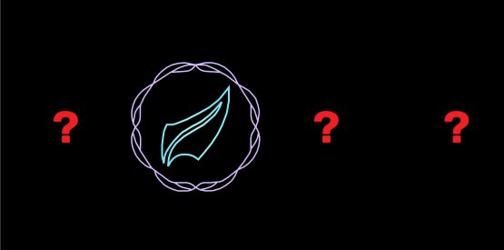

# mots-puzzle-wow-react

> Simple React component to practice the MoTS dungeon puzzle in World of Warcraft: Shadowlands

[](https://www.npmjs.com/package/mots-puzzle-wow-react) [](https://standardjs.com)



[Click here to try!](https://wlchs.github.io/mots-puzzle-wow-react/)

## Install

```bash
npm install --save mots-puzzle-wow-react
```

or

```bash
yarn add mots-puzzle-wow-react
```

## Usage

```jsx
import React from 'react'
import Puzzle from 'mots-puzzle-wow-react'

function Example() {
  return <Puzzle />
}
```

## License

MIT © [wlchs](https://github.com/wlchs)
